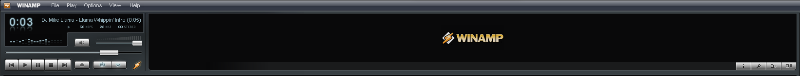

Latest Version: 1.2.7 ([Changelog](https://github.com/SecurityRaven/Winamp-BigBentoUP/blob/changelogs/1.2.7.txt))
# Winamp Big Bento Redux
This repository keeps alive the famous skin of Winamp 5, Big Bento by updating some componets and resolving some bugs that were present and not resolved.
 
## WACUP Support
This skin works great on WACUP with the latest preview update. I am aiming to update the window elements in order to bring the Big Bento style completed to WACUP!

## Installing the skin:
- On the repo, press code -> Download ZIP
- Create a folder called "Big BentoU+" on ``<your winamp installation directory>\Skins`` and extract the zip into the folder
- Run Winamp or WACUP and select the skin.
- Enjoy!
## Compiling the scripts (maki)

### "Traditional" Way:

Compile the scripts 1 by 1 using the following command ``.\mc.exe <script name>``

Therefore, it's recommended to compile them with Vichtor's Winamp Compiler: https://drive.google.com/file/d/1rejKyZkHaDyFJh-iARvx_QIFQkzMbqO8/view
### Recommended Way (All automaticly):
Place ALL the .m files on the folder and run the file ``buildall.bat``/

