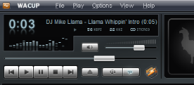

# Winamp Big BentoU+
This repository keeps alive the famous skin of Winamp 5, Big Bento by updating some componets and resolving some bugs that were present and not resolved.
## WACUP Support
This skin works great on WACUP with the latest preview update. I am aiming to update the window elements in order to bring the Big Bento style completed to WACUP!

## Rotary Tweaker
This version of the skin includes the latest version of the Rotary Tweaker. Learn more about the Rotary Tweaker here: https://github.com/SecurityRaven/winamp-rotary-tweaker
## Compiling the scripts (maki)

Compile the scripts using the following command ``.\mc.exe <script name>``
 
